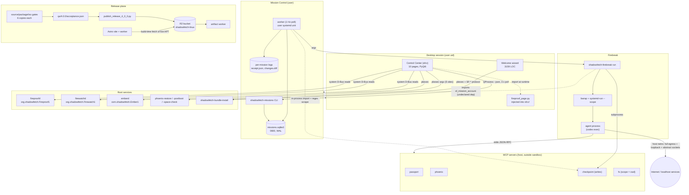
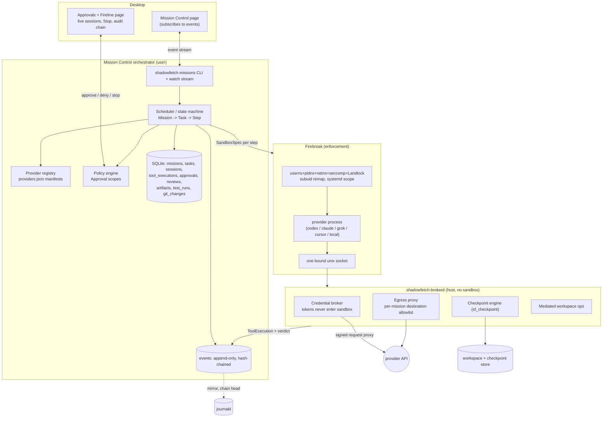

# ARCHITECTURE_AUDIT.md — Shadowfetch Linux 4.0.0

Scope: `~/projects/shadowfetch-4.0.0` (released 4.0.0 source), `~/.sfbuild/release-sources/shadowfetch-linux-site`, `web/shadowfetch-linux-worker`. Synthesised from eight domain audits (Mission Control, Fireline/Firebreak, privilege boundaries, packaging/release, desktop apps, recovery/telemetry, web/publish, testing). All severities reconciled globally; where two audits disagreed, the higher severity is carried and the reconciliation is noted in §3.

---

## 1. Executive summary

Shadowfetch Linux 4.0.0 is a KDE/Debian-testing derivative whose product thesis is *agent safety*: a coding agent runs full-auto inside a bubblewrap sandbox (**Firebreak**), against one workspace, with a pre-run Btrfs/tar **checkpoint**, and the human reviews a diff and either accepts or undoes. Around that sit **Mission Control** (a queue + CLI + Qt page that runs Codex missions), **Phoenix** (root-subvolume rollback), **Fireproof** (simulate-first updates via a root D-Bus daemon), **Firewatch** (root telemetry daemon), **Control Center** and **Welcome** (PyQt6), and a signed APT repo + ISO published to R2 behind two Cloudflare Workers.

The engineering is uneven in a specific and diagnosable way: the *narrow* pieces are excellent (hwscan's fixture suite, `sf_mission_account.py`'s credential validation, `publish_release_4_0_0.py`'s all-or-nothing plan with immutable-object refusal, `build_apt_repo.py`'s dual-implementation signature verification, Firebreak's environment scrub), while every *seam* between components is an undocumented convention — a prose string scraped by regex, an argv shape asserted in one place out of three, an environment variable that silently relocates a security boundary.

The five things that matter most:

1. **Firebreak is a filesystem boundary and nothing else.** `--net allow` does not create a network namespace at all (`shadowfetch-firebreak:112-113`), and Mission Control makes `--net allow` *mandatory* for every code and report mission (`sf_missions.py:285-286`). So the normal configuration shares the host's network namespace — full egress, every loopback service, and the host's abstract AF_UNIX socket namespace (verified live: `@/tmp/.X11-unix/X0`, ollama:11434, sshd:22). There is no seccomp filter, no capability policy, no uid remap, and the agent runs as the human's own uid. Worse, the one credential Firebreak hands the agent — the Codex `auth.json` — is bind-mounted **read-write** into the sandbox (`shadowfetch-firebreak:133`) alongside guaranteed egress.
2. **There is no provider abstraction, and the release gate forbids creating one.** "Provider" is the string `config["runtime"]` with two legal values, welded 1:1 to mission `kind`, re-validated in five places, and dispatched by `getattr(self, kind)()` (`sf_missions.py:706`). `tools/mission_provider_contract.py:25` asserts `set(runtimes) == {"codex","offline"}` by AST-parsing the source, and is enforced by the source gate, the package gate *and* the ISO gate. Adding Claude Code, Grok, Cursor or a local model is a build failure by construction — and the AST approach also forbids the refactor itself.
3. **The release process was routed around, and the tooling that would have stopped it cannot run.** `.git` in the 4.0.0 tree points at a deleted parent worktree, so `git ls-files`, `git diff --check` and the `gitleaks git` history scan all fail — `make source-gate` is unrunnable in the tree that produced the shipped ISO. `qa/4.0.0/acceptance.json` has 13 of 18 required cases at `pending` with no evidence and a null bundle hash, yet the ISO is live; `publish_release_4_0_0.py` refuses that manifest today. R2 holds a 4.0.0 ISO next to a **3.5.0-1** APT tree, and the live `InRelease` expires **2026-09-20**, twelve days out, with no refresh path that does not require a full rebuild the acceptance gate would reject.
4. **Nothing agentic is observable, auditable or blockable.** Agent tool calls are never parsed (`sf_missions.py:502-516` keeps only `turn.completed` and the last `agent_message`); `approval_policy="never"` is hard-coded; the four MCP servers — including `checkpoint.undo`, which rmtree's a workspace — write zero log lines; Firebreak's session record omits the agent command entirely and is overwritten in place; and the human review diff is blind to `.git`, symlink swaps and mode changes and is forgeable by a newline in a filename. There is no correlation id joining a mission to a sandbox session to a checkpoint.
5. **Duplication is the dominant maintenance cost and the direct cause of shipped defects.** Six near-identical copies of every gate script (~14,500 lines in `tools/`, of which ~2,700 are live and untested — the unit tests target the 2.1.4/2.1.5 copies); five copies of the Umbra palette; three copies of the workspace-name rule; two complete divergent system updaters; three implementations of "current release". Two shipped 4.0.0 buttons are dead because the correct argv existed in two places and the third copy was written from a docstring: Control Center bundle installs omit the helper verb, and every timed Ember option passes a flag the root helper rejects — both after the user has entered an admin password.

---

## 2. Current architecture

### 2.1 Component inventory

| Component | Path (under `~/projects/shadowfetch-4.0.0` unless noted) | LOC | Purpose |
|---|---|---|---|
| Mission Control engine | `packages/shadowfetch-missions/data/usr/lib/shadowfetch/missions/sf_missions.py` | 896 | Queue, SQLite store, sandbox invocation, the single Codex adapter, workflows, review/undo, 1 Hz worker, CLI |
| Mission account | `.../missions/sf_mission_account.py` | 90 | Dedicated Codex home, strict owner/mode/nlink checks, flock, `codex login` |
| Mission user unit | `.../usr/lib/systemd/user/shadowfetch-missions.service` | — | `worker`, `EnvironmentFile=-%h/.config/shadowfetch/missions/codex.env`, autostarted for every desktop user |
| Firebreak | `packages/shadowfetch-fireline/data/usr/bin/shadowfetch-firebreak` | 275 | bwrap sandbox launcher; `run|check|log`; systemd-run scope; session manifest |
| Checkpoint CLI | `.../data/usr/bin/shadowfetch-checkpoint` | 67 | Thin front end that calls the MCP handler objects directly |
| MCP servers | `.../data/usr/lib/shadowfetch/mcp/sf_mcp.py` | 534 | Hand-rolled JSON-RPC; `passport`, `phoenix`, `checkpoint` (writes), `fs` |
| Control Center | `packages/shadowfetch-control-center/.../sfcc/` (10 pages + `app.py`, `theme.py`, `busutil.py`, `mission_client.py`) | ~4,877 | PyQt6 shell; all D-Bus reads, all pkexec argv, Mission Control UI |
| Welcome wizard | `packages/shadowfetch-welcome/src/shadowfetch-welcome` | 3,159 | First-run wizard, element choice, catalog installs |
| Bundle installer | `packages/shadowfetch-welcome/data/usr/libexec/shadowfetch-bundle-install` | 636 | Root helper (`auth_admin_keep`) for catalog installs; SF-* line protocol |
| Phoenix | `packages/shadowfetch-phoenix/usr/libexec/*` (`phoenix-restore` 254, `-firstboot` 123, `-postboot` 86, `-space-check` 109, `-apt-repair` 82, `-desktop-reset` 123, `-recovery-report` 133, `-overlay-banner` 79) | ~989 | Root-subvolume snapshot/exchange rollback, APT repair, diagnostics |
| Fireproof daemon | `packages/shadowfetch-fireproof/data/usr/libexec/fireproofd` | 1,227 | Root system-bus daemon; simulate → approve → commit → verify updates |
| Fireproof CLI / page / postboot | `.../bin/fireproof` 302, `.../bin/shadowfetch-fireproof` 667, `.../libexec/fireproof-postboot` 117 | — | CLI, standalone Qt page injected into `sfcc/`, first-boot-after-update check |
| Firewatch daemon | `packages/shadowfetch-firewatchd/usr/libexec/firewatchd` | 1,355 | Root telemetry on `org.shadowfetch.Firewatch1`; 2 s sweep; root-only smartd socket |
| Ember | `packages/shadowfetch-ember/usr/libexec/{emberd 722, ember-duration 143, ember-restore}` | ~1,014 | Performance mode; root daemon + passwordless pkexec duration helper |
| hwscan | `packages/shadowfetch-hwscan/usr/libexec/shadowfetch-hwscan` | 513 | Boot-time hardware facts → `/var/lib/shadowfetch/hwscan.json` |
| defaults | `packages/shadowfetch-defaults/data/usr/bin/*` (`shadowfetch-passport` 751, `-facts` 514, `-workbench` 394, `-gpu` 389, `-update` 342, `-grok-bot` 316, `-recovery` 35, …) + 8 units | ~2,100 | CLI surface, second updater, GPU installer, first-boot script |
| drkonqi-pickup | `packages/shadowfetch-drkonqi-pickup/` (CMake + vendored 6.6.5 tarball + patch) | 181 | Crash-pickup override via a user-unit drop-in |
| themes / branding / menus / meta / grub-btrfs | `packages/shadowfetch-{themes,branding,menus,meta}`, `packages/grub-btrfs` | — | Look-and-feel, wallpapers, menu categories, metapackages |
| Gate tooling | `tools/{source,package,iso}_gate_*.py`, `verify_acceptance_*`, `build_release_evidence_*` (6 versions each) | 14,461 | Release gates; only ~2,717 lines are the live 4.0.0 copies |
| QA harness | `tools/qa_4_0_0/` (16 scripts) | — | VM/installed-image acceptance; 100% human-driven |
| ISO build | `live-build/` (auto/config, 10 hooks, Calamares config, 20 package lists) | — | Debian-testing snapshot pin, local signed repo, squashfs |
| Artifact worker | `web/shadowfetch-linux-worker/src/index.js` | 1,795 | R2 downloads, APT proxy, `_stats`, 410 pages — plus ~1,100 lines of dead HTML |
| Public site | `~/.sfbuild/release-sources/shadowfetch-linux-site` (Astro + `src-worker/index.js` 162) | — | shadowfetchlinux.org; release manifests are the site's single source of truth |
| Publisher | `tools/publish_release_4_0_0.py` | 177 | Gated, all-or-nothing R2 publication with readback + re-digest |

### 2.2 Dependency map



Read that diagram for what is *missing*: no arrow from the agent path to journald, auditd or Firewatch; no arrow back from Firebreak to Mission Control carrying a session id; no arrow from any gate to the ISO that shipped.

---

## 3. Major problems

**Severity reconciliations.** Where audits disagreed: the `--net allow` no-namespace finding is **P0** (fireline P0 over privilege P1) because Mission Control makes it mandatory; the read-write credential bind is **P0** (missions P0 over fireline P1) for the same reason; the unscoped `fs` MCP server is **P0** (fireline P0 over privilege P1) because the shipped `shadowfetch-mcp config` output creates it; the broken git worktree is **P0** (packaging/testing/missions P0 over recovery P3) because it disables the secret-scan gate for a released tree. Duplicate IDs are merged and cross-referenced below.

### 3.1 Firebreak is not a security boundary in the shipped configuration — P0

- **No network namespace on the mandatory path.** `shadowfetch-firebreak:112-113` adds `--unshare-net` only when `net == "none"`; `:94` derives the default from the cosmetic fire/ice theme (`element()`, `:40-47`), and `sf_missions.py:285-286` refuses any code/report mission that is not `network="allow"`. Verified live: host abstract sockets (`@/tmp/.X11-unix/X0`, `@cuda-uvmfd-*`) and loopback services (ollama 11434, sshd 22/2222, NFS 2049, SMB 445) are reachable from inside. *(SEC-NET-01 / SEC-FB-01)*
- **The credential is inside the sandbox, writable.** `shadowfetch-firebreak:133` uses `--bind` (not `--ro-bind`) for the Codex account dir and `:134` sets `CODEX_HOME`; `:116-117` *requires* `net == "allow"` for that grant. Report missions concatenate untrusted documents into the prompt (`sf_missions.py:589`) and run with `approval_policy="never"`. *(MISS-SEC-01 / SEC-CRED-02)*
- **No second layer.** No `--seccomp`, no `--cap-drop`, no uid remap, nested userns permitted, `/usr` bound read-only in full including every setuid binary; the agent runs as the human's uid. *(SEC-BOUND-01)*
- **Report missions get a writable workspace at the OS layer**; read-only is a flag interpreted by the contained process (`sf_missions.py:490` vs `firebreak:111`). *(MISS-SEC-03)*
- **Validation runs with full egress** because `run_process` reuses the mission-level `--net` for the test command too (`sf_missions.py:419` used at `:628`). *(MISS-SEC-07)*
- **Persistence escapes containment.** Agent-written `.git/hooks`, `.git/config` exec keys, `.envrc`, `package.json` scripts and `node_modules/.bin` shims execute on the host the next time the human opens the project; neither the diff nor undo treats them specially. *(SEC-PERSIST-01)*

**Impact:** for the product's primary use case the practical boundary is "one writable directory", with the user's ChatGPT refresh token inside it and unrestricted egress out of it.

### 3.2 The first-party MCP `fs` server is a home-directory read oracle — P0

`sf_mcp.py:468` defaults `SF_MCP_FS_ROOT` to `Path.cwd()`, and the config the product tells users to generate (`shadowfetch-mcp config --json|--claude`, `FIRELINE.md:18-19`) sets no `env` block. Verified live: launched from `$HOME` it advertises itself as "scoped to /home/rtx5060ti" and returns `.ssh/` contents. Every test pins the variable, so the shipped default is never exercised. `debian/control` describes it as "scoped read-only file access". *(SEC-MCP-01)*

### 3.3 Passwordless and unauthenticated root paths — P0/P1

- `org.shadowfetch.fireline.check` sets `allow_active=yes` and annotates `exec.path=/usr/bin/shadowfetch-firebreak` — pkexec passes the caller's whole argv, and that binary's `run` subcommand ends in `subprocess.Popen(cmd)` with `nargs=REMAINDER` (`:147`, `:210`). It has no caller anywhere in the tree. What blocks exploitation today is undocumented and accidental: pkexec resets `HOME`, so the workspace root becomes `/root/Workspaces`. *(SEC-PKX-01, P0)*
- `fireproofd.Verify()` (`:1120-1129`) has no `sender_keyword` and no `_require_auth`, and its needrestart block does `systemctl restart <svc>` as root (`:635-653`); the bus policy allows any local uid on any interface (`Fireproof1.conf:16-19`). `Analyze()` (`:844-856`) is likewise unauthenticated and spawns an unbounded thread building a full `apt.Cache()` per call. *(SEC-FP-01 P0, SEC-FP-02 P1)*
- `phoenix-recovery-report` takes `$1` as an unvalidated output path and does `mkdir -p`/`tar -czf`/`chmod`/`chown $PKEXEC_UID` as root, under `auth_admin_keep` — one legitimate diagnostics export converts into a session-long arbitrary-root-write capability. It has no in-tree caller. *(SEC-PKX-02, P1)*
- Four privileged operations run through pkexec with **no registered action**, including `pkexec /bin/sh -c` (`busutil.py:511`) whose two named-helper alternatives do not exist in the tree. *(SEC-PKX-03, P2)*

### 3.4 Privileged GUI actions are PATH-hijackable — P0

`busutil.terminal_command` (`:659-670`) wraps a command string in `konsole -e bash -lc`, and `/etc/skel/.profile` prepends `$HOME/bin` and `$HOME/.local/bin` to PATH. Callers pass bare names: `shadowfetch-gpu`, `shadowfetch-recovery`, `shadowfetch-health`, `shadowfetch-update`, `shadowfetch-agent-workspace`. Every pkexec invocation names `"pkexec"` relatively; so do `systemctl` and `shadowfetch-missions`. Two lines in `~/.bashrc` — the file an escaped agent writes first — own the buttons whose real tools then ask for a root password. `shadowfetch-gpu:383` compounds this by re-execing `$0` under pkexec with no polkit action of its own. *(SEC-PATH-01 P0, SEC-GPU-01 P1)*

### 3.5 Mission Control cannot express the target architecture — P0/P1

- `tools/mission_provider_contract.py:25` freezes runtimes to `{codex, offline}` and is enforced by `source_gate_4_0_0.py:217`, `package_gate_4_0_0.py:239`, `iso_gate_4_0_0.py:774`. It reaches its data by AST-parsing `capabilities()` for a literal `return {...}` — so a registry-driven `capabilities()` makes the gate raise `ValueError`, and a rename makes a bare `next()` raise `StopIteration` rather than a policy failure. *(MISS-GATE-01, P0)*
- Provider identity is five scattered literals plus `getattr(self, kind)()` (`sf_missions.py:274, 275, 283-286, 476, 691, 706, 798, 845`), repeated in the UI (`missions_page.py:139, 166`). "Run this same mission with Claude instead" is not expressible in the schema. Grok Bot is a second launcher page with no engine integration at all. *(MISS-ARCH-01, ARCH-MISSION-01, P1)*
- No state machine: `Store.update` allow-lists *columns*, not values; `ACTIVE`/`FINAL` are declared and `FINAL` is unused; transitions are enforced ad hoc at five call sites. *(MISS-ARCH-02, P2)*

### 3.6 Nothing an agent does is observable, auditable or blockable — P1

- Only `turn.completed` and the final `agent_message` are parsed (`sf_missions.py:502-516`); `approval_policy="never"` (`:490`). No ToolExecution record, no Approval object, no mid-run block. *(MISS-OBS-01)*
- The review diff prunes `.git` and `node_modules` (`sf_missions.py:40`, `tree_index:116`), is blind to symlink swaps and mode changes, truncates silently at 500 entries, and is forgeable by a newline in a filename (all demonstrated live). Undo's `recovery_index` walks everything, so the user is simultaneously told "no changes" and "cannot undo". *(MISS-OBS-02, SEC-DIFF-01)*
- The four MCP servers write zero audit records, including `checkpoint.undo`. *(AUDIT-MCP-01)*
- Firebreak's session manifest omits `agent_command` entirely and is **overwritten** at exit; there is no correlation id joining mission ↔ session ↔ checkpoint ↔ tool call. Evidence is split across four uncorrelated, uid-writable stores. `debian/control` claims journald audit; nothing writes to journald. *(AUDIT-CORR-01, MISS-AUD-01, SEC-AUDIT-01, AUDIT-TAMPER-01)*
- Consent lives only in the Qt dialog; the engine will queue and run a network-enabled cloud mission for any local process (`sf_missions.py:272-306`, `:879-880`). *(MISS-SEC-04)*

### 3.7 Recovery can silently stop working, and restore is not crash-atomic — P0

- Two unordered first-boot units race to create the snapper root config with opposite policies (`firstboot.sh:56-73` `TIMELINE_CREATE=yes/NUMBER_LIMIT=12/ALLOW_USERS` vs `phoenix-firstboot:61-105` `no/8/ALLOW_GROUPS` plus the mandatory `@snapshots` dance). Losing the race nests `.snapshots` inside `@`, so `phoenix-restore:122` fails for every point — and a restore that did run would `mv --exchange` away the entire snapshot history. Fireproof keeps advertising rollback because `phoenix_available()` (`fireproofd:227-244`) checks only fstype + config existence. *(REC-PHX-01 P0, CONTRACT-FP-01 P1)*
- `phoenix-restore` mutates `/boot` (moves kernels, `update-grub`) **before** the atomic exchange, and the `EXIT INT TERM` trap only syncs and unmounts — `rollback_external_boot` is called from two explicit failure paths and never from the trap. An interrupt in that window leaves grub.cfg pointing at deleted kernels. *(REC-PHX-02, P0)*
- Leftovers are never fully reclaimed: the newest `@_prev_*` is kept forever despite the user being told cleanup is automatic, and `/boot/phoenix-kernel-backup-*` is never cleaned by anything. *(PHX-04, P2)*
- `shadowfetch-recovery` — the tool the updater tells users to run when an update fails — is a 35-line stale menu that mentions none of the Phoenix tools. *(RECOVERY-MENU-01, P2)*

### 3.8 The release pipeline was bypassed and cannot currently run — P0

- **Broken worktree.** `.git` → deleted `~/projects/shadowfetch-3.5.0/.git/worktrees/...`. `source_gate_4_0_0.py:88-94` dies on `git ls-files`; the gitleaks history scan (`:176-212`) and `git diff --check` (`:363`) never run; `pre_release_check.sh:38` *skips* its credential-state check and still prints `PRE_RELEASE_CHECK_PASSED`. *(REL-GATE-GIT-01 / GATE-GIT-01 / MISS-REL-01 / OPS-WORKTREE-18, P0)*
- **Acceptance bypassed.** 13 of 18 required cases `pending`, `evidence_bundle_sha256` null; `verify_acceptance_4_0_0.py verify` fails today; `make acceptance-audit` runs with `--allow-pending` and passes anyway. Evidence is self-asserted with no binding to the artifact, no signature, and a 0-byte file hashes fine. *(TEST-REL-01, ACC-INTEGRITY-01, P0/P1)*
- **Publication mismatch.** The 4.0.0 ISO is live but all eight evidence artifacts 404, and `apt/dists/umbra` still lists `3.5.0-1` while a complete signed 4.0.0-1 repo sits unpublished in `repo/`. `publish_release_4_0_0.py` cannot even build a plan (evidence files absent). *(REL-PUBLISH-01, P0)*
- **Dated outage.** Live `InRelease` `Valid-Until: 2026-09-20`; the local replacement expires the same day; the site's own `release:verify` freshness gate (7-day minimum) blocks *all* site deploys from **2026-09-13**. *(OPS-APT-EXPIRY-01 / REL-APT-EXPIRY-02, P0)*
- **Destructive publish tooling.** `r2_prune_release.py:104-112` never validates that the kept version exists — `--version 4.0` deletes every ISO, checksum and signature under `releases/`; and its keep-set deletes exactly the retired `.sha256`/`.asc` sidecars the worker's 410 pages link and the README promises to keep. `r2_s3_publish.py` stamps every object `release=1.9.0`, overwrites without a guard, and verifies only byte count. *(SEC-R2-PRUNE-01 / SEC-PRUNE-03 P0, SEC-PRUNE-04 P1, REL-S3PUB-15 P2)*
- **APT trust.** The ISO installs first-party packages with `[trusted=yes]` (signature checking off) and ships the release key into `/etc/apt/trusted.gpg.d/` — globally trusted for *every* repository — twice, under two names. *(BUILD-TRUSTED-YES-01, SEC-APTKEY-TRUST-01, P1)*

### 3.9 Two shipped desktop actions are dead — P0/P1

`software_page.py:113` builds `["pkexec", BUNDLE_INSTALL, bundle_id]` with no verb, so all 7 Bundles Install buttons exit 2 *after* the admin password prompt (the correct form is used at `workbench_page.py:202` and `welcome:961`). `ember_page.py:355` passes `--duration <n>`, which `ember-duration:72-91` rejects; `_helper_done` then reports "Authorisation was cancelled" — blaming the user for a grant they gave — and all three timed Ember options never start. The one gate that checks this argv pattern (`package_gate_4_0_0.py:331`) looks at a single call site one file away. *(UI-ARGV-01 P0, UI-ARGV-02 P1, TEST-GAP-01 P2)*

### 3.10 Packaging and metapackage do not describe the product — P1

`shadowfetch-desktop` depends on none of phoenix, fireproof, firewatchd, hwscan, control-center or ember — they reach the image only via a live-build package list. `shadowfetch-fireproof` writes `fireproof_page.py` into `shadowfetch-control-center`'s Python package with no declared relationship in either direction, and the importing `except Exception` cannot catch the `SystemExit` that module can raise. `shadowfetch-fireline` imports `sf_mission_account` from the missions package while declaring no dependency on it — the security boundary depends on the thing it contains. Two packages set `APT::Periodic::Unattended-Upgrade` to opposite values; `85fireproof` wins, so a testing-tracking desktop gets no automatic security updates while `52shadowfetch-unattended.conf` documents the opposite. *(PKG-01, ARCH-PLUGIN-01, MISS-PKG-01, CONF-APT-01)*

---

## 4. Security concerns

### 4.1 Root-execution entry points

| # | Entry point | Mechanism | Who may invoke | Auth | Caller-controlled input? | Verdict |
|---|---|---|---|---|---|---|
| 1 | `/usr/bin/shadowfetch-firebreak` | polkit `org.shadowfetch.fireline.check` | any active local user | **none** (`allow_active=yes`) | **full argv, incl. `run -- <cmd>`** | **P0 — delete the action** |
| 2 | `/usr/libexec/ember-duration` | polkit `com.shadowfetch.ember.duration` | any active local user | none | numeric 60–86400, profile id `^[a-z0-9-]+$` vs root-owned files | clean (but UI passes a rejected flag) |
| 3 | `/usr/libexec/shadowfetch-ignition-state` | polkit `org.shadowfetch.ignition-state` | any active local user | none | verb ∈ {save-choice, mark-done} | clean |
| 4 | `/usr/libexec/shadowfetch-bundle-install` | polkit `org.shadowfetch.bundle-install` | `auth_admin_keep` | password (kept) | catalog id vs root-owned catalog; PKG_RE | good; but inherits `os.environ` into root apt (`:91-96`) |
| 5 | `/usr/libexec/phoenix-restore` | polkit `org.shadowfetch.phoenix.restore` | `auth_admin_keep` | password (kept) | `$1` positive integer | validated; **not crash-atomic** |
| 6 | `/usr/libexec/phoenix-recovery-report` | polkit `org.shadowfetch.phoenix.recovery-report` | `auth_admin_keep` | password (kept) | **unvalidated output path** | **P1 — arbitrary root write + chown** |
| 7 | `pkexec /bin/sh -c <script>` | none (falls to `policykit.exec`) | any admin | password | fixed script, `yes`/`no` interpolated | P2 — unscoped root shell prompt |
| 8 | `/usr/libexec/phoenix-apt-repair` | none registered | any admin | password | none | P2 — no action id, rewrites `/etc/apt` + keyring |
| 9 | `shadowfetch-gpu` (`as_root "$0"`) | none registered | any admin | password | **`$0`** | P1 — re-execs its own invocation path |
| 10 | `shadowfetch-grok-bot _install` | none registered | any admin | password | pinned URL + SHA-256 + package identity | acceptable, but no action id |
| 11 | `org.shadowfetch.Fireproof1` | system D-Bus, `User=root`, bus-activated | **any local uid, any interface** | polkit on 5 of 10 methods | `Verify`, `Analyze`, `GetState`, `RollbackTarget` **ungated** | **P0 (`Verify`) / P1 (`Analyze`)** |
| 12 | `org.shadowfetch.Firewatch1` | system D-Bus, root | any local uid | none by design | `Subscribe` mutates cadence; rows cover **all** uids | P2 — cross-user activity disclosure |
| 13 | `com.shadowfetch.Ember1` | system D-Bus, root | any local uid | none | read-only; `Properties.Set` always refuses | clean |
| 14 | `/run/shadowfetch/firewatch-smartd.sock` | AF_UNIX 0600 | root only (`SO_PEERCRED`) | n/a | JSON, 64 KiB cap | clean — the one well-bounded privileged IPC |
| 15 | polkit rule `50-shadowfetch-ember.rules` | JS rule | local+active | none | unit == `shadowfetch-ember.service`, verb ∈ {start,stop,restart} | correctly scoped |
| 16 | Root units: firstboot, hwscan, phoenix-{first,post}boot, phoenix-space-check (APT `DPkg::Pre-Invoke`), fireproof-postboot, flatpak-system-update, rfkill-unblock, regdomain, element-boot, grub-btrfsd | systemd | n/a | n/a | `/run/phoenix-overlay` **sourced as shell** by `phoenix-restore:68` | P2 — latent root code-exec primitive |
| 17 | `shadowfetch-missions.service` (user) | user systemd | the user | n/a | `EnvironmentFile` can set `PATH` | **P1 — replaces the sandbox with a shim** |

No setuid/setgid or world-writable files exist anywhere in `packages/`, `live-build/config/` or `tools/`; temp-file discipline is uniformly `mktemp`/`tempfile`. No live credentials are committed; R2 secrets are derived in memory and never written. Those are genuine strengths.

### 4.2 Is Firebreak a real boundary?

**Filesystem: yes, and well built.** `--unshare-user/-pid/-uts/-ipc`, `--new-session` (blocks `TIOCSTI`), `--clearenv` plus an explicit setenv allowlist, a `--dir /etc` with a 14-entry allowlist, private `/home/agent`, `--tmpfs /tmp,/run`, one rw workspace bind, and a `systemd-run --user --scope` carrying `TasksMax`/`MemoryMax`/`CPUQuota`. Verified absent from the argv: `/sys`, session and system D-Bus sockets, container sockets, `SSH_AUTH_SOCK`, `~/.ssh`, `~/.config`, `~/.gnupg`, `/etc/shadow`, `/dev/dri`, `/dev/nvidia*`.

**Everything else: no.**

| Dimension | Status |
|---|---|
| Network | **Not isolated** on the mandatory path — no netns, so host loopback *and* the abstract AF_UNIX namespace are shared. No egress policy, no proxy, no destination record. |
| Credentials | Codex `auth.json` bind-mounted **read-write** at a known path, with egress guaranteed by the same code path. |
| Syscalls | No seccomp. No `--cap-drop`. Nested userns available. |
| Identity | Runs as the human's own uid — an escape is immediate full-account compromise. |
| Workspace mode | Always read-write, even for "read-only" report missions. |
| In-workspace secrets | `is_private()` blocks `.env`/`.ssh`/keys as *inputs* while the whole workspace, including them, is bound in. UI copy says "No access to other personal folders". |
| Persistence | Agent-written git hooks / `.envrc` / build scripts execute on the host afterwards; unreviewed. |
| Enforcement of the binary | Resolved through `PATH` from a user-writable `EnvironmentFile`. |
| Audit | One overwrite-in-place 0600 JSON file per session, without the command; nothing to journald. |
| Test coverage | The only test that starts bwrap is run by no automation; the argv suite contains two tautological assertions that cannot fail. |

**Verdict:** Firebreak today contains *accidental* filesystem damage. It does not contain a hostile or prompt-injected agent, and it is cosmetic for the single most valuable secret on the machine. Making it real requires four changes — unconditional netns + brokered egress, credential broker instead of a bind, seccomp + Landlock + subuid, and step-scoped sandbox specs — plus wiring `test_firebreak.sh` into the build so regressions are caught (it already contains the assertion for the RLIMIT_AS defect that cost an ISO respin).

---

## 5. Technical debt

**Duplication (the dominant cost).**
- 29 version-suffixed gate scripts, 14,461 lines, ~81% frozen duplicates; `verify_acceptance_4_0_0.py` is a 3-line diff from the 2.1.4 copy, and 26 of the 106 `tools/tests` cases are byte-identical pairs targeting the *old* copies while the live 4.0.0 gate logic (`critical_payload_parity_gate`, `drkonqi_gate`, the diverged `payload_gate`/`main`) has no test.
- Five copies of the Umbra palette (`sfcc/theme.py`, `shadowfetch-welcome`, `shadowfetch-fireproof`, `guide_page.py`'s exported HTML, `ShadowfetchDark.colors`), plus ten unnamed stray hexes; the fireproof page is mounted *inside* the Control Center with a different red.
- Two complete updaters (`shadowfetch-update` 342 lines of bash + sudo vs `fireproofd` 1,227 lines of D-Bus + polkit) with two rollback vocabularies, two `snapper_first_pre_after` implementations and four copies of `package_lock_busy`.
- Three implementations of "the current release" (manifest date+numeric semver, R2 upload order, and a test with a *string* tiebreak that diverges from 4.10.0 onward).
- Three implementations of the workspace-name rule (`firebreak:52`, `sf_mcp:147`, `mission_client.py:20-32`) that already disagree on leading-dot names.
- Two `@_prev` GC loops, verbatim but with different mount/trap handling.
- Three implementations of bundle install, hwscan freshness, catalog load and NM connectivity across `sfcc` and `welcome`.

**Dead code.** ~1,100 lines of unreachable HTML in the artifact worker, including a changelog frozen at 1.9.0 and "local AI built in" copy that 4.0 defers; `input_text`'s auto-discovery branch (`sf_missions.py:521-535`) has no caller; `FINAL` is declared and unused; `_vram_total` is never assigned so firewatchd's documented three-term heat score is dead; `weekly_release.sh` is a gate-bypassing auto-publish script pointing at a nonexistent tree and eradicated Hermes credentials; `packages.manifest` is 2.1.1-era and read by nothing; four orphaned OG cards; the Ice look-and-feel's own splash can never render.

**Fragility.** The recovery guarantee rides on a regex over a prose sentence, scraped by two independent parsers (`sf_missions.py:701`, `firebreak:193-196`) from an f-string meant for a language model. `latestRelease()` truncates an R2 listing at 100 objects twenty lines from a correct cursor loop. The 1 Hz worker takes the exclusive lock and JSON-decodes the whole mission table twice a second for every desktop user forever — which is *why* `REVIEW_LOCK_WAIT_SECONDS` exists. `LIMIT 1000` in `Store.list` turns undo into an uncaught `StopIteration` and silently disables the single-pending-review invariant. Every checkpoint tars the whole workspace (the btrfs fast path needs `CAP_SYS_ADMIN` and never fires unprivileged) with no retention, no quota and no free-space check — and Firebreak refuses to run if the snapshot fails, so a full disk is a hard denial of the safety feature. Restore leaks a subvolume and a `/boot` kernel set per run.

**Error handling.** Unguarded `subprocess`/`write_text` inside Qt slots abort the Control Center; the recovery-report export blocks the GUI thread for up to ~90 s on an already-broken machine; the mission worker's SIGTERM handler does SQLite writes from signal context against a 30 s busy timeout under a 15 s `TimeoutStopSec`; `undo()` rmtree's the live workspace before restoring, non-atomically, with no free-space check; `firstboot.sh` runs 15 mutations with every status discarded and then unconditionally stamps done.

**Undocumented contracts** (full list in the per-domain audits): Codex CLI argv + JSONL event vocabulary; the `auth.json` layout; the checkpoint receipt sentence; Firebreak's CLI as an ABI; `capabilities()`'s required source *shape*; six security-relevant environment variables with no schema (`SHADOWFETCH_AGENT_WORKSPACES`, `XDG_STATE_HOME`, `SHADOWFETCH_CHECKPOINT_BIN`, `SF_MCP_FS_ROOT`, `SHADOWFETCH_ELEMENT`, `SHADOWFETCH_MISSIONS_COMMAND`); the SF-* line protocol; `/run/phoenix-overlay` as sourced shell; btrfs top-level names as an API; `VERSION_TOKEN` → gate filename; the signing fingerprint hardcoded in five files; R2 key layout and mutability classes.

**Testing.** 359 unittest cases over ~13,000 LOC of first-party runtime code, no coverage measurement anywhere. Zero automated tests for Phoenix (~1,000 lines incl. the root-subvolume swap), Ember (~1,000 lines incl. a passwordless pkexec helper), Welcome (3,159 lines) and its 636-line root installer. CI runs `make test` + a hand-rolled subset of the source gate; it runs no gate and no acceptance. The site tree — where `deploy` → `release:verify` → `test` makes shipping without tests impossible — is the discipline the distro build lacks.

---

## 6. Proposed architecture

### 6.1 Shape

Mission Control stops being "a queue that knows how to run Codex" and becomes **an orchestration layer over a provider registry, with a privileged-broker boundary underneath it**. Four structural moves:

1. **`AgentProvider` registry.** Providers become packaged plugins declaring a manifest (id, capabilities, credential ids, sandbox profile, network requirement, invocation module). The engine resolves `(capability, provider)` from a registry instead of `getattr(self, kind)`. `kind` (what the human wants: `CodeChange`, `SourcedReport`, `MediaExport`) separates from `provider` (who does it), so "run this mission with Claude instead" becomes a column value.
2. **Broker on the boundary.** A host-side `shadowfetch-brokerd` (user scope) owns credentials, checkpoints, policy evaluation and the audit chain. Firebreak binds **one unix socket** into the sandbox instead of a token. Every agent action that leaves the workspace — an API call, a checkpoint, a network destination, a privileged operation — is a brokered request that is recorded as a `ToolExecution`, evaluated against policy, and either auto-approved inside a declared boundary or escalated to a desktop prompt.
3. **Firebreak becomes a provider-neutral, step-scoped primitive.** It gains `--workspace-mode {rw,ro}`, `--mask <relpath>`, `--bind-credential-dir SRC:DST[:ro]`, `--session-id`, `--seccomp`, unconditional `--unshare-net` with brokered egress, Landlock, and a subuid remap; it *loses* `--codex-account` and its import of `sf_mission_account`. Sandbox specs are per **step**, not per mission (inference: net allowlist; validation: net none; media: net none).
4. **One event/audit spine.** A single append-only, hash-chained `events` table is the system of record, mirrored to journald so the chain head leaves the user's trust domain. The desktop subscribes to a stream instead of polling; Firewatch and the Control Center read the same events.

### 6.2 Where each provider plugs in

| Provider | Transport | Credential | Sandbox profile | Events |
|---|---|---|---|---|
| Codex CLI | `codex exec --json -` (stdin prompt, JSONL out) | brokered OpenAI/ChatGPT session | rw workspace, net allowlist `api.openai.com` | JSONL → normalised `Event` |
| Claude Code | `claude -p --output-format stream-json` | brokered Anthropic key/session | rw workspace, net allowlist `api.anthropic.com` | stream-json → `Event` |
| Grok | CLI/HTTP adapter | brokered `XAI_API_KEY` | rw workspace, allowlist `api.x.ai` | adapter-normalised |
| Cursor | headless CLI | brokered token | rw workspace, allowlist | adapter-normalised |
| Local model | localhost socket **bound in explicitly** by the broker | none | rw workspace, **net none** | adapter-normalised |
| Offline media | `ffmpeg`/`ffprobe` | none | rw workspace, net none | synthetic step events |

Every provider passes the same conformance suite (fixture stream in → normalised events out, no network) before it can be registered. Grok Bot — today a launcher page with its own auth and no sandbox — is the first onboarding target precisely because it proves the interface is real.

### 6.3 Human-in-the-loop flow

1. The user (or an automated caller with a pre-granted, scoped, expiring `Approval`) creates a `Mission` naming a capability, a workspace and a boundary.
2. `run` refuses without a valid `Approval`; the GUI is one client of the approval mechanism, minted through polkit, not its sole location.
3. The engine takes a checkpoint, resolves a provider, and starts an `AgentSession` inside Firebreak with a step-scoped `SandboxSpec`.
4. Every tool call streams through the broker → `ToolExecution` row → policy verdict (`auto_allow` inside the declared boundary, `escalate` otherwise, `deny` for the never-list) → desktop prompt with a live "Stop" affordance.
5. On completion the engine emits a `Review` with the diff, a **structural `GitChange` summary that cannot be omitted**, the test result computed against a pristine overlay, the credential identities actually granted, the read grants, and the egress log.
6. Accept or Undo; Undo is transactional (`renameat2(RENAME_EXCHANGE)`) with a free-space precheck.



---

## 7. Data model recommendations

**Storage choice.** Keep **SQLite (WAL)** in controller state (`~/.local/state/shadowfetch/missions/missions.sqlite3`, dir `0700`, file `0600`) as the operational store: it is already there, it is transactional, it survives crashes, and it needs no daemon. Add two things it lacks: (a) a **schema-version table and real migrations** (today it is `CREATE TABLE IF NOT EXISTS` only), and (b) a **journald mirror of the `events` chain head** so tamper evidence leaves the user's uid — SQLite cannot provide that on its own, and a root-owned append-only journal is the cheapest external high-water mark available on this platform. Do **not** move to a daemon-backed DB; the failure modes (availability, another root service) are worse than the problem.

**Permissions.** State dir `0700`, DB `0600`, per-mission dirs `0700`, receipts `0600`. `Store.__init__` must keep refusing a state root inside the workspace root. Broker-written rows (`tool_executions`, `events`) are written only by `shadowfetch-brokerd`; the CLI has read-only access to them via a view. Nothing in the schema is readable from inside a sandbox.

```sql
PRAGMA journal_mode=WAL;

CREATE TABLE schema_version (version INTEGER NOT NULL);

-- Registry: one row per installed provider manifest, refreshed at package install.
CREATE TABLE agent_providers (
  id             TEXT PRIMARY KEY,          -- 'codex', 'claude-code', 'grok', 'cursor', 'local-llama', 'offline-media'
  display_name   TEXT NOT NULL,
  package        TEXT NOT NULL,             -- Debian binary package providing the adapter
  version        TEXT NOT NULL,             -- adapter version (stamped)
  binary_path    TEXT,                      -- absolute; NULL for in-process adapters
  binary_version TEXT,                      -- observed `--version`, refreshed on capability probe
  capabilities   TEXT NOT NULL,             -- JSON array: ['code_change','sourced_report','media_export']
  credential_ids TEXT NOT NULL,             -- JSON array of broker credential ids
  network_policy TEXT NOT NULL,             -- 'none' | 'allowlist' | 'broker'
  allowlist      TEXT NOT NULL,             -- JSON array of hostnames
  sandbox_profile TEXT NOT NULL,            -- 'rw-workspace' | 'ro-workspace' | 'offline'
  enabled        INTEGER NOT NULL DEFAULT 1,
  manifest_sha256 TEXT NOT NULL,
  registered_at  TEXT NOT NULL
);

CREATE TABLE workspaces (
  id        TEXT PRIMARY KEY,               -- stable id, not the path
  name      TEXT NOT NULL UNIQUE,           -- direct child of the workspace root
  path      TEXT NOT NULL,                  -- absolute, resolved once
  vcs       TEXT,                           -- 'git' | NULL
  created_at TEXT NOT NULL,
  masked_paths TEXT NOT NULL DEFAULT '[]'   -- JSON: masked inside the sandbox bind
);

CREATE TABLE missions (
  id           TEXT PRIMARY KEY,
  title        TEXT NOT NULL,
  capability   TEXT NOT NULL,               -- what the human wants
  provider_id  TEXT NOT NULL REFERENCES agent_providers(id),
  workspace_id TEXT NOT NULL REFERENCES workspaces(id),
  state        TEXT NOT NULL,               -- validated against TRANSITIONS
  prompt       TEXT NOT NULL,
  config       TEXT NOT NULL,               -- JSON: model, inputs, test cmd, timeout
  approval_id  TEXT REFERENCES approvals(id),
  checkpoint_id TEXT,
  attempt      INTEGER NOT NULL DEFAULT 0,
  max_attempts INTEGER NOT NULL DEFAULT 3,
  error        TEXT,
  created_at   TEXT NOT NULL,
  updated_at   TEXT NOT NULL,
  cancel_requested INTEGER NOT NULL DEFAULT 0
);
CREATE INDEX missions_queue ON missions(state, created_at);
CREATE INDEX missions_ws_pending ON missions(workspace_id, state);

CREATE TABLE tasks (                        -- replaces the ad-hoc `steps` memo
  id         TEXT PRIMARY KEY,
  mission_id TEXT NOT NULL REFERENCES missions(id) ON DELETE CASCADE,
  seq        INTEGER NOT NULL,
  kind       TEXT NOT NULL,                 -- 'checkpoint','inference','validate','publish','media'
  state      TEXT NOT NULL,
  depends_on TEXT NOT NULL DEFAULT '[]',    -- JSON array of task ids
  sandbox_spec TEXT NOT NULL,               -- JSON SandboxSpec actually enforced for this step
  started_at TEXT, finished_at TEXT, exit_code INTEGER, error TEXT,
  UNIQUE(mission_id, seq)
);

CREATE TABLE agent_sessions (
  id                  TEXT PRIMARY KEY,     -- also the Firebreak --session-id
  mission_id          TEXT NOT NULL REFERENCES missions(id) ON DELETE CASCADE,
  task_id             TEXT REFERENCES tasks(id),
  provider_id         TEXT NOT NULL REFERENCES agent_providers(id),
  provider_version    TEXT NOT NULL,
  attempt             INTEGER NOT NULL,
  firebreak_session   TEXT,                 -- correlation into the sandbox manifest
  sandbox_spec        TEXT NOT NULL,        -- JSON, as enforced
  credential_grants   TEXT NOT NULL,        -- JSON array of credential ids (identities, never values)
  read_grants         TEXT NOT NULL,        -- JSON array of absolute paths bound ro
  egress_allowlist    TEXT NOT NULL,        -- JSON array
  command             TEXT NOT NULL,        -- redacted argv actually executed
  started_at TEXT NOT NULL, ended_at TEXT, exit_code INTEGER,
  usage               TEXT                  -- JSON: tokens, model, cost if reported
);
CREATE INDEX sessions_mission ON agent_sessions(mission_id, started_at);

CREATE TABLE tool_executions (
  id            TEXT PRIMARY KEY,
  session_id    TEXT NOT NULL REFERENCES agent_sessions(id) ON DELETE CASCADE,
  seq           INTEGER NOT NULL,
  at            TEXT NOT NULL,
  tool          TEXT NOT NULL,              -- 'shell','apply_patch','read_file','http','checkpoint.snapshot',...
  args_redacted TEXT NOT NULL,              -- JSON, secret-scrubbed
  args_digest   TEXT NOT NULL,              -- sha256 of canonical args, pre-redaction
  decision      TEXT NOT NULL,              -- 'auto_allow' | 'approved' | 'denied' | 'blocked_policy'
  approval_id   TEXT REFERENCES approvals(id),
  exit_code     INTEGER,
  output_digest TEXT,
  bytes_changed INTEGER,
  UNIQUE(session_id, seq)
);
CREATE INDEX tool_exec_decision ON tool_executions(decision, at);

CREATE TABLE approvals (
  id          TEXT PRIMARY KEY,
  subject     TEXT NOT NULL,                -- 'mission:<id>' | 'workspace:<id>' | 'tool:<session>:<seq>'
  scope       TEXT NOT NULL,                -- JSON: capability, provider, network, credential_ids, paths
  granted_by  TEXT NOT NULL,                -- uid + polkit subject
  method      TEXT NOT NULL,                -- 'polkit' | 'desktop-prompt' | 'preauthorised'
  granted_at  TEXT NOT NULL,
  expires_at  TEXT,
  revoked_at  TEXT,
  reason      TEXT
);

CREATE TABLE reviews (
  id            TEXT PRIMARY KEY,
  mission_id    TEXT NOT NULL REFERENCES missions(id) ON DELETE CASCADE,
  requested_at  TEXT NOT NULL,
  decided_at    TEXT,
  decision      TEXT,                       -- 'accept' | 'undo' | 'expired'
  decided_by    TEXT,
  diff_path     TEXT NOT NULL,
  diff_truncated INTEGER NOT NULL DEFAULT 0,
  blast_radius  TEXT NOT NULL               -- JSON: new executables, new symlinks out, hooks, build entry points
);

CREATE TABLE git_changes (
  id          TEXT PRIMARY KEY,
  mission_id  TEXT NOT NULL REFERENCES missions(id) ON DELETE CASCADE,
  repo_path   TEXT NOT NULL,
  head_before TEXT, head_after TEXT,
  refs_changed TEXT NOT NULL DEFAULT '[]',
  remotes_added TEXT NOT NULL DEFAULT '[]',
  hooks_changed TEXT NOT NULL DEFAULT '[]',
  exec_config_keys TEXT NOT NULL DEFAULT '[]'
);

CREATE TABLE artifacts (
  id         TEXT PRIMARY KEY,
  mission_id TEXT NOT NULL REFERENCES missions(id) ON DELETE CASCADE,
  path       TEXT NOT NULL,
  sha256     TEXT NOT NULL,
  bytes      INTEGER NOT NULL,
  kind       TEXT NOT NULL,                 -- 'report','media','patch','log','receipt'
  created_at TEXT NOT NULL
);

CREATE TABLE test_runs (
  id          TEXT PRIMARY KEY,
  mission_id  TEXT NOT NULL REFERENCES missions(id) ON DELETE CASCADE,
  task_id     TEXT REFERENCES tasks(id),
  command     TEXT NOT NULL,
  overlay_mode TEXT NOT NULL,               -- 'pristine-overlay' | 'in-place'
  guard_state TEXT NOT NULL,                -- 'intact' | 'modified' | 'files-added'
  exit_code   INTEGER,
  duration_ms INTEGER,
  log_path    TEXT NOT NULL,
  network     TEXT NOT NULL                 -- 'none' | 'allowlist'
);

-- The system of record. Append-only; no UPDATE, no DELETE.
CREATE TABLE events (
  seq        INTEGER PRIMARY KEY AUTOINCREMENT,
  at         TEXT NOT NULL,
  mission_id TEXT, session_id TEXT, task_id TEXT, tool_execution_id TEXT,
  actor      TEXT NOT NULL,                 -- 'user' | 'orchestrator' | 'broker' | 'provider:<id>'
  kind       TEXT NOT NULL,                 -- 'mission.created','state.changed','approval.granted',
                                            -- 'tool.requested','tool.decided','egress.attempt','session.ended'
  detail     TEXT NOT NULL,                 -- JSON, secret-scrubbed
  prev_hash  TEXT NOT NULL,
  hash       TEXT NOT NULL                  -- sha256(prev_hash || canonical(row-without-hash))
);
CREATE INDEX events_mission ON events(mission_id, seq);
CREATE INDEX events_session ON events(session_id, seq);

-- Convenience view for the audit UI; `audit_log` is `events` — there is exactly one log.
CREATE VIEW audit_log AS SELECT * FROM events ORDER BY seq;
```

Relationships: `Mission 1—N Task 1—N AgentSession 1—N ToolExecution`; `Mission 1—1 Review`, `1—N Artifact`, `1—N TestRun`, `1—0..1 GitChange`; `Approval` is referenced by both `Mission` (the run grant) and `ToolExecution` (the per-action escalation); `Event` references all of them and is the only append-only table.

---

## 8. APIs / interfaces that should exist

```python
# /usr/lib/shadowfetch/missions/sf_providers.py
"""Provider abstraction. One implementation per agent runtime; no branching elsewhere."""

from __future__ import annotations
from dataclasses import dataclass
from pathlib import Path
from typing import Iterator, Literal, Protocol, Sequence

Capability = Literal["code_change", "sourced_report", "media_export"]
NetworkMode = Literal["none", "allowlist", "broker"]
WorkspaceMode = Literal["rw", "ro"]


@dataclass(frozen=True)
class SandboxSpec:
    """What Firebreak will enforce for ONE step. Never mission-wide."""
    workspace: str
    workspace_mode: WorkspaceMode
    network: NetworkMode
    egress_allowlist: tuple[str, ...]
    read_grants: tuple[Path, ...]
    masked_paths: tuple[str, ...]          # relative to the workspace, tmpfs'd over
    credential_ids: tuple[str, ...]        # broker identities, never values
    memory_mb: int
    cpu_seconds: int
    processes: int
    seccomp_profile: str


@dataclass(frozen=True)
class Invocation:
    argv: Sequence[str]                    # absolute binary path, never PATH-resolved
    stdin_path: Path | None
    env: dict[str, str]                    # allowlisted; contains no secrets
    sandbox: SandboxSpec


@dataclass(frozen=True)
class AgentEvent:
    """Normalised across providers. One per observable agent action."""
    kind: Literal["message", "tool_request", "tool_result", "usage", "turn_end", "error"]
    at: str
    tool: str | None
    args: dict | None
    text: str | None
    usage: dict | None
    raw_digest: str


class AgentProvider(Protocol):
    id: str
    display_name: str
    version: str

    def capabilities(self) -> frozenset[Capability]: ...
    def accepts(self, capability: Capability, config: dict) -> None:
        """Raise ProviderError with a human reason if this provider cannot serve the task."""
    def readiness(self) -> dict:
        """{'installed': bool, 'authenticated': bool, 'missing': [...], 'login_command': [...]}"""
    def sandbox_profile(self, capability: Capability, config: dict) -> SandboxSpec: ...
    def credential_grants(self, config: dict) -> tuple[str, ...]: ...
    def build_invocation(self, prompt: str, capability: Capability, config: dict) -> Invocation: ...
    def stream_events(self, line: str) -> Iterator[AgentEvent]:
        """Parse ONE line of the provider's native stream into zero or more AgentEvents."""


class ProviderRegistry(Protocol):
    def register(self, provider: AgentProvider, manifest_sha256: str) -> None: ...
    def get(self, provider_id: str) -> AgentProvider: ...
    def for_capability(self, capability: Capability) -> list[AgentProvider]: ...
    def manifest(self) -> dict:
        """Rendered from providers.json; what `--json capabilities` returns to the UI."""
```

```python
# /usr/lib/shadowfetch/missions/sf_policy.py
"""Approval and policy. The GUI is one client of this, not its home."""

from typing import Literal, Protocol
from dataclasses import dataclass

Verdict = Literal["auto_allow", "escalate", "deny"]


@dataclass(frozen=True)
class Scope:
    capability: str
    provider_id: str
    workspace_id: str
    network: str
    egress_allowlist: tuple[str, ...]
    credential_ids: tuple[str, ...]
    expires_at: str | None


@dataclass(frozen=True)
class Approval:
    id: str
    subject: str
    scope: Scope
    granted_by: str
    method: Literal["polkit", "desktop-prompt", "preauthorised"]
    granted_at: str
    expires_at: str | None
    revoked_at: str | None


class PolicyEngine(Protocol):
    def evaluate_mission(self, mission_id: str, scope: Scope) -> Approval:
        """Raise NotApproved unless a valid, unexpired, unrevoked Approval covers this scope."""
    def evaluate_tool(self, session_id: str, tool: str, args: dict) -> Verdict:
        """Consulted by the broker BEFORE the action runs. Never returns after the fact."""
    def escalate(self, session_id: str, tool: str, args: dict, timeout_s: int) -> Approval | None:
        """Block the tool call and raise a desktop prompt; None means denied or timed out."""
    def grant(self, subject: str, scope: Scope, *, method: str) -> Approval: ...
    def revoke(self, approval_id: str, reason: str) -> None: ...
```

```python
# /usr/lib/shadowfetch/missions/sf_audit.py
"""One append-only, hash-chained log, mirrored to journald."""

from typing import Iterator, Protocol


class AuditLog(Protocol):
    def append(self, *, actor: str, kind: str, detail: dict,
               mission_id: str | None = None, session_id: str | None = None,
               task_id: str | None = None, tool_execution_id: str | None = None) -> int:
        """Returns the new seq. Scrubs secrets. Mirrors the row to journald
        with SYSLOG_IDENTIFIER=shadowfetch-audit and the chain head."""
    def read(self, *, mission_id: str | None = None, session_id: str | None = None,
             since_seq: int = 0) -> Iterator[dict]: ...
    def verify(self) -> tuple[bool, int | None]:
        """Recompute the chain. Returns (ok, first_broken_seq)."""
    def subscribe(self, since_seq: int = 0) -> Iterator[dict]:
        """Long-lived stream backing `shadowfetch-missions --json watch` and the UI."""
```

```python
# /usr/lib/shadowfetch/broker/sf_broker.py
"""Host-side broker. Holds every secret; the sandbox holds one socket."""

from typing import Literal, Protocol
from dataclasses import dataclass


@dataclass(frozen=True)
class BrokerRequest:
    session_id: str
    seq: int
    op: Literal["provider_call", "http", "checkpoint.snapshot", "checkpoint.diff",
                "checkpoint.undo", "workspace.write", "credential.use"]
    args: dict


@dataclass(frozen=True)
class BrokerResponse:
    ok: bool
    decision: Literal["auto_allow", "approved", "denied", "blocked_policy"]
    payload: dict | None
    reason: str | None


class FirebreakBroker(Protocol):
    def open_session(self, session_id: str, spec: "SandboxSpec") -> str:
        """Create the socket Firebreak will bind in. Returns its host path."""
    def handle(self, request: BrokerRequest) -> BrokerResponse:
        """Record a ToolExecution, consult PolicyEngine, perform or refuse. Never
        returns a credential value to the caller — only the result of using it."""
    def close_session(self, session_id: str, exit_code: int) -> None: ...
    def stop_session(self, session_id: str, reason: str) -> None:
        """Human 'Stop' from the Fireline page: kill the scope, record the reason."""
```

```python
# /usr/bin/shadowfetch-firebreak (argv contract, provider-neutral)
#   run --session-id <id>
#       --workspace <name> --workspace-mode {rw,ro}
#       --net {none,allowlist} [--allow-host <host>]...
#       --mask <relpath>...
#       --read <abs-path>...
#       --bind-credential-dir <src>:<dst>[:ro]
#       --broker-socket <host-path>:<sandbox-path>
#       --seccomp <profile>
#       --memory-mb N --cpu-seconds N --processes N
#       -- <argv>
```

---

## 9. Recommended directory structure

```
shadowfetch-linux/
├── Makefile                              # thin; no per-version tokens
├── packages/
│   ├── shadowfetch-missions/             # orchestrator only, no provider code
│   │   └── data/usr/lib/shadowfetch/missions/
│   │       ├── sf_missions.py            # CLI + worker (thin)
│   │       ├── sf_store.py               # schema, migrations, state machine
│   │       ├── sf_audit.py               # hash chain + journald mirror
│   │       ├── sf_policy.py              # Approval / PolicyEngine
│   │       ├── sf_providers.py           # AgentProvider protocol + registry
│   │       ├── sf_scheduler.py           # Mission -> Task -> Step
│   │       └── sf_mission_account.py
│   ├── shadowfetch-broker/               # NEW: host-side broker (user unit)
│   │   └── data/usr/lib/shadowfetch/broker/{sf_broker.py,sf_credentials.py,sf_egress.py}
│   ├── shadowfetch-provider-codex/       # one package per provider
│   │   └── data/usr/lib/shadowfetch/providers/codex/{provider.py,providers.d/codex.json}
│   ├── shadowfetch-provider-claude/
│   ├── shadowfetch-provider-grok/
│   ├── shadowfetch-provider-cursor/
│   ├── shadowfetch-provider-local/
│   ├── shadowfetch-provider-offline-media/
│   ├── shadowfetch-fireline/
│   │   └── data/usr/
│   │       ├── bin/{shadowfetch-firebreak,shadowfetch-checkpoint,shadowfetch-mcp}
│   │       └── lib/shadowfetch/{checkpoint/sf_checkpoint.py,mcp/sf_mcp.py,seccomp/*.bpf}
│   ├── shadowfetch-phoenix/
│   │   ├── usr/lib/python3/dist-packages/shadowfetch/phoenix/{layout.py,restore.py,gc.py}
│   │   ├── usr/libexec/{phoenix-restore,phoenix-postboot,phoenix-space-check,...}
│   │   └── tests/
│   ├── shadowfetch-control-center/
│   │   └── .../sfcc/{app.py,page.py,context.py,theme.py,busutil.py,pages/*.py,plugins/}
│   ├── shadowfetch-welcome/{src,data,tests}/
│   ├── shadowfetch-{fireproof,firewatchd,ember,hwscan,defaults,themes,branding,menus,meta}/
│   └── shared/                            # importable by more than one package
│       └── usr/lib/python3/dist-packages/shadowfetch/{apt.py,secrets.py,atomicio.py,desktop/*.py}
├── tools/
│   ├── release/
│   │   ├── gate.py                        # `gate.py --version X {source,package,iso,accept,evidence}`
│   │   ├── {source_gate,package_gate,iso_gate,acceptance,evidence}.py
│   │   └── versions/{2.1.4,...,4.0.0}.toml
│   ├── qa/                                # was qa_4_0_0/, version-neutral
│   ├── providers/validate_manifest.py     # replaces mission_provider_contract.py
│   └── tests/
├── live-build/
├── web/shadowfetch-linux-worker/          # artifacts only (~600 lines)
├── qa/<version>/acceptance.json
└── vendor/
```

---

## 10. Testing strategy

**Layer 1 — unit (fast, no privilege).** Every root helper's decision logic extracted into importable functions and fixture-tested: Phoenix snapshot selection and refusal predicates against fixture `snapper list`; `ember-duration` argument validation; `bundle-install` id/verb validation; `fireproofd`'s commit arc using the existing `stubs.py` pattern; `firewatchd`'s payload builders and subscriber lifecycle; `hwscan`'s two-GPU bus-id mapping. Target: no root script ships with zero tests.

**Layer 2 — contract (the load-bearing layer for the target architecture).**
- **`AgentProvider` conformance suite:** one parametrised class every registered provider must pass against a fake transport — declared capabilities honoured; no execution without an explicit network grant; only named credentials reach the process; `Cancelled` honoured within the timeout; provenance recorded; `stream_events` normalises a captured fixture stream into the expected `AgentEvent` sequence with no network.
- **Privileged-argv contract:** enumerate every argv literal in `sfcc/*.py` and `shadowfetch-welcome` whose first element is `pkexec` and check it against each helper's declared grammar (`--contract --json`). This alone catches both shipped P0/P1 desktop defects.
- **Ship-list contract:** for each package, expand `.install` globs against the payload tree and assert the built `.deb` contains exactly that set at exactly those paths, failing in both directions with an explicit exceptions file.
- **Cross-package UI contract:** every key the Control Center reads from `capabilities()` must exist in its output.
- **Manifest/schema contracts:** JSON Schema for `providers.json`, the acceptance manifest, `releases/*.json` and the mission receipt.

**Layer 3 — integration (Firebreak actually starts).** Wire `test_firebreak.sh` into `make test` and extend it: device visibility, `/etc` allowlist equality, cgroup limits actually applied, abstract-socket connect **fails**, credential dir is `--ro-bind`, `--net allow` default asserted rather than overridden. Drive `sf_mcp` over real JSON-RPC asserting one audit row per tool call and that a denied policy produces no filesystem change. Run at least one Mission Control end-to-end test with `sandbox=True` — today every mission test sets `sandbox=False`, so Firebreak is never in the loop. Replace the two tautological assertions in `test_firebreak_4.py:48-49` with parsed bind-triple checks.

**Layer 4 — VM acceptance (automated, self-recording).** `make vm-acceptance` drives `tools/qa/vm_harness.sh` and, on success, calls `verify_acceptance record` with the produced evidence, so running the suite and recording the result are one action. First three to automate: `INSTALL-01` (headless Calamares install + boot from disk), `UPGRADE-01`, `RECOVERY-01` (snapshot → mutate root → restore → reboot → assert), plus a power-cut negative case (SIGKILL during `phoenix-restore`).

**Layer 5 — release gates.** CI runs `make source-gate` (replacing its hand-rolled syntax subset) and `make package-gate`. Coverage is measured (`python3 -m coverage` around the unittest invocations) and published as a CI artifact — the work cannot be prioritised without a number.

**Invariant:** no test that exists in the tree may be unreachable from `make test` or `make vm-acceptance`; and no evidence, no publish.

---

## 11. Migration strategy

The shipped product must keep working for installed users throughout. Five rules:

1. **Stabilise before refactoring.** Fix the dated outage (APT re-sign + publish), repair version control, and land the six one-to-ten-line security/correctness fixes first. None of them changes an interface, so they can ship as 4.0.1 with the existing gates.
2. **Preserve every external contract.** polkit `exec.path` values, D-Bus names and member signatures, the `shadowfetch-missions --json` verb set, the `SF-*` line protocol, `receipt.json` schema 1, `hwscan.json` schema 1 and the R2 key layout do not change during the refactor. Where a contract must grow, add fields; never repurpose one.
3. **Refactor behind the existing surface.** `sf_providers.py` lands with `CodexCliProvider` and `OfflineMediaProvider` moved verbatim from `Executor.codex` and `Executor.media`; `capabilities()` renders the registry and returns the *same* keys plus new ones; `getattr(self, kind)` becomes a registry lookup. The CLI, the UI and the receipt see no difference — which is exactly how the conformance suite proves the seam is behaviour-preserving.
4. **Migrate data forward, never sideways.** Add `schema_version` and write real migrations: new columns default to values that reproduce today's behaviour (`capability` derived from `kind`, `provider_id` derived from `runtime`, `events.prev_hash` seeded at the migration point with a genesis row recording that everything before it is unchained). Old missions remain listable and undoable.
5. **Sequence the boundary change so nothing is briefly less safe.** Firebreak gains `--workspace-mode`, `--mask`, `--session-id`, `--bind-credential-dir` and `--seccomp` *before* `--codex-account` is removed; the broker ships and is exercised in parallel with the direct credential path *before* the bind is deleted; `--unshare-net` becomes unconditional only once the brokered egress path passes the conformance suite, with `allowlist` as the default and `allow` retained behind an explicit, recorded per-mission Approval for one release.

Gate compatibility: `tools/providers/validate_manifest.py` replaces the AST freeze in the same commit that adds the registry, keeping `REMOVED_AI_PATH` (the payload blacklist is the good half) so the local-AI deferral stays provable. The per-version gate collapse happens once, between releases, with the old scripts moved to `tools/archive/` if reproducing an old image is a real requirement.

---

## 12. Prioritized work plan

| ID | Recommendation | Sev | Effort | Component | Phase |
|---|---|---|---|---|---|
| W-01 | Re-sign and publish the 4.0.0-1 APT repo; raise `REPO_VALID_FOR`; add `make refresh-index` that re-exports/re-signs `dists/**` without an ISO rebuild | P0 | M | packaging/web | 1 |
| W-02 | Repair version control (`git init` + `fetch` + `reset --mixed v4.0.0`); add `.gitignore` for staging trees/`__pycache__`/`live-build` state; delete stale `work/*.bundle` | P0 | S | release tooling | 1 |
| W-03 | Make gates fail loudly without git: named error in `source_gate` `candidate_files()`, `add_failure` in `pre_release_check.sh:38`, `--no-git` fallback running `gitleaks dir` | P0 | S | release tooling | 1 |
| W-04 | Delete `org.shadowfetch.fireline.policy` and its `.install` line | P0 | S | fireline | 1 |
| W-05 | `build_fs()` refuses to start without `SF_MCP_FS_ROOT`; apply the `read_grants` denylist; emit `env` in every generated MCP config | P0 | S | fireline | 1 |
| W-06 | Add `sender_keyword` + `_require_auth` to `fireproofd.Verify`; split a read-only `Inspect()`; narrow the bus policy to named interfaces/members | P0 | S | fireproof | 1 |
| W-07 | `r2_prune_release.py`: require the kept ISO to exist, validate `--version` shape, `--max-deletes` ceiling, never delete `.asc`/`.sha256` | P0 | S | web | 1 |
| W-08 | Fix `software_page.py:113` (missing `install` verb) and `ember_page.py:355` (positional duration); distinguish pkexec 126/127 from helper errors | P0 | S | control-center | 1 |
| W-09 | Absolute-path every privileged/system binary; replace `bash -lc` with a non-login `sh -c` in a sanitised PATH; drop `SHADOWFETCH_MISSIONS_COMMAND`/`GROK_BOT_COMMAND` overrides | P0 | M | control-center/missions | 1 |
| W-10 | Delete the snapper block in `firstboot.sh:55-73`; order `shadowfetch-firstboot` after `phoenix-firstboot`; add `phoenix-check-layout` | P0 | M | recovery | 1 |
| W-11 | `phoenix-restore`: trap covers `/boot` rollback with an `EXCHANGED` guard; write an intent journal; add `--dry-run` | P0 | M | recovery | 1 |
| W-12 | Wire `test_firebreak.sh` into `make test`; extend with device/`/etc`-allowlist/cgroup/abstract-socket assertions; assert defaults instead of overriding them | P0 | S | fireline/testing | 1 |
| W-13 | Regenerate 4.0.0 evidence; finish publication via `publish_release_4_0_0.py --apply`; make the credentialled path the only publish path | P0 | M | release | 1 |
| W-14 | Add `waived` status (with approver+reason) to acceptance; split `acceptance-audit` (`--allow-pending`) from a hard `acceptance-gate`; reject 0-byte and low-entropy evidence | P0 | M | release | 1 |
| W-15 | Fix `Store.list` `LIMIT 1000` invariants: direct SQL for pending-review and undo predicates; catch `StopIteration`/`Exception` in `main()`; paginate `list` | P1 | S | missions | 1 |
| W-16 | Guard NEW test/config files in `verify_validation_guard`; widen the predicate; run validation against a pristine overlay | P1 | M | missions | 1 |
| W-17 | Structural `GitChange` summary in the diff and receipt; typed diff rows (symlink/mode/type); escape paths; explicit truncation trailer | P1 | M | missions/fireline | 1 |
| W-18 | Confine `phoenix-recovery-report`'s `$1` to a basename inside its own directory; 0600 output; strip disk serials; redact dmesg | P1 | S | recovery | 1 |
| W-19 | Drop `[trusted=yes]`; move the release key to `/usr/share/keyrings` with `signed-by=`; remove the duplicate; tighten the ISO gate | P1 | M | packaging | 1 |
| W-20 | Bound `firewatchd` caches (LRU), stop calling `LoadUnit`, move D-Bus lookups off the tick, `DeviceAllow=block-* r` | P1 | M | firewatchd | 1 |
| W-21 | Serialize/cache `fireproofd.Analyze`; make `Update`'s polkit check async; rate-limit per sender | P1 | M | fireproof | 1 |
| W-22 | `providers.json` manifest + `capabilities()` renders it; replace `mission_provider_contract.py` with a manifest+policy validator, keeping `REMOVED_AI_PATH` | P0 | M | missions/gates | 2 |
| W-23 | `sf_providers.py`: `AgentProvider`, `SandboxSpec`, `Invocation`, `AgentEvent`, registry; move Codex and offline media behind it verbatim | P1 | L | missions | 2 |
| W-24 | Replace `getattr(self, kind)()` with a registry lookup; collapse the five runtime validations into `provider.accepts()`; add a `capability` column | P1 | M | missions | 2 |
| W-25 | Provider conformance test suite + fixture streams; ship with the interface | P1 | M | testing | 2 |
| W-26 | Schema migration: `schema_version`, `tasks`, `agent_sessions`, `tool_executions`, `approvals`, `reviews`, `artifacts`, `test_runs`, `git_changes`, chained `events` | P1 | L | missions | 2 |
| W-27 | Real state machine: `TRANSITIONS` table validated in `Store.update`; emit transition events atomically; delete or use `FINAL` | P2 | S | missions | 2 |
| W-28 | Extract `sf_checkpoint.py`; structured `{"id","method","workspace"}` return; retire both prose scrapers; add `--json` to the CLI | P2 | M | fireline | 2 |
| W-29 | Shared `shadowfetch.secrets` redaction: sliding-window across reads, one credential-name table shared with Firebreak, provider prefix patterns | P2 | S | missions/fireline | 2 |
| W-30 | Shared desktop library (`catalog`, `hwscan`, `net`, `launch`, `bundle_install_argv`) imported by `sfcc` and Welcome; fix Welcome's dead "Create workspace…" | P2 | M | desktop | 2 |
| W-31 | `sfcc` Page protocol + single registry; context-object constructors; `badge_count`/`blocking_reason`; rename `AgentsPage` | P1 | M | control-center | 2 |
| W-32 | Explicit plugin contract for `fireproof_page.py` (`plugins/` dir, `PAGE_API`, `build_page(context)`); catch `BaseException`; declare the dependency | P2 | M | control-center/fireproof | 2 |
| W-33 | `AuditLog`: append-only hash chain + journald mirror + `verify()`; single correlation id threaded mission→session→tool | P1 | L | missions/broker | 3 |
| W-34 | Parse provider streams into `ToolExecution` rows as they stream; drop `approval_policy="never"` | P1 | L | missions/providers | 3 |
| W-35 | `PolicyEngine` + `Approval` persisted; `run` refuses without one; polkit-minted grants; GUI becomes one client | P1 | L | missions | 3 |
| W-36 | Replace 1 Hz worker poll and 3 s UI poll with inotify/socket wake + `watch --json` stream; scope the execution lock per workspace | P1 | M | missions/control-center | 3 |
| W-37 | Firebreak session manifest: add `command`, `parent`, `--session-id`, resolved bwrap argv; append instead of overwrite | P1 | M | fireline | 3 |
| W-38 | Audit sink + approval hook in `sf_mcp.Server.dispatch`; mark mutating tools; gate or remove agent-facing `undo` | P1 | M | fireline | 3 |
| W-39 | Render readiness facts in the New Mission dialog (`installed`/`authenticated`/tools) and gate Queue; drop the non-existent `summary` key | P2 | S | control-center | 3 |
| W-40 | Provider-agnostic New Mission dialog driven by `capabilities()`; fold Grok Bot in as a provider | P1 | M | control-center | 3 |
| W-41 | Fireline page in Control Center: live sessions from the `fb-*` scopes, manifest detail, Stop, Undo, verified audit chain, pending approvals | P2 | L | control-center | 3 |
| W-42 | `shadowfetch-brokerd`: credential broker over a bound unix socket; remove `--codex-account` and the `sf_mission_account` import from Firebreak | P0 | L | broker/fireline | 4 |
| W-43 | Unconditional `--unshare-net`; `allowlist` via pasta/slirp4netns + authenticated CONNECT proxy; per-session egress log in the manifest and receipt | P0 | L | fireline/broker | 4 |
| W-44 | `--workspace-mode {rw,ro}`, `--mask <relpath>`, `--bind-credential-dir`, step-scoped `SandboxSpec` (net none for validation/media) | P1 | M | fireline/missions | 4 |
| W-45 | seccomp denylist profile, Landlock second layer, subuid remap, assert `PR_SET_NO_NEW_PRIVS` and record it | P1 | L | fireline | 4 |
| W-46 | Validate `SHADOWFETCH_AGENT_WORKSPACES`; pin perimeter vars at worker start; drop `SHADOWFETCH_CHECKPOINT_BIN`; harden the `EnvironmentFile` load | P1 | M | fireline/missions | 4 |
| W-47 | Dir-fd traversal with `O_NOFOLLOW` + `fstat` in `scoped`/`tree_index`/`recovery_index` (TOCTOU) | P1 | M | missions | 4 |
| W-48 | Checkpoint retention (N snapshots / M bytes), free-space precheck, hardlink/content-addressed dedupe, honest btrfs-vs-tar reporting | P1 | M | fireline | 4 |
| W-49 | Atomic `undo` via sibling restore + `renameat2(RENAME_EXCHANGE)` + disk-usage precheck; explicit partial-state error | P1 | M | fireline | 4 |
| W-50 | Blast-radius classifier (git hooks, exec config keys, `.envrc`, new executables, outward symlinks, build entry points) blocking mission completion | P1 | M | missions/fireline | 4 |
| W-51 | Move the element out of `theme.py`: `/etc/shadowfetch/element` authoritative, per-user may only tighten, re-read per dialog, show the source | P1 | M | desktop | 4 |
| W-52 | Onboard Claude Code, Grok and Cursor as registry providers; each passes the conformance suite | P1 | L | providers | 5 |
| W-53 | Multi-provider missions: `max_parallel > 1` via per-workspace locks; per-step provider selection; retry across providers | P2 | L | missions | 5 |
| W-54 | Local-model provider over a broker-bound localhost socket, net none | P2 | M | providers/broker | 5 |
| W-55 | Collapse 29 gate scripts to `tools/release/` + `versions/<v>.toml`; repoint tests; delete duplicated test files | P1 | L | release tooling | 5 |
| W-56 | `make vm-acceptance` driving the QA harness and recording evidence; automate `INSTALL-01`, `UPGRADE-01`, `RECOVERY-01` + a power-cut negative case | P1 | L | testing | 5 |
| W-57 | Ship-list gate (`dh_missing --fail-missing` / reverse `.install` check); fix `UmbraEmblem`/`UmbraVault` and `GROK-BOT.md.gz` | P2 | M | packaging | 5 |
| W-58 | Single palette source (`palette.json` in branding) generating `.colors`/`.colorscheme`/`theme.conf`/Splash/HTML; fix the Ice look-and-feel self-reference | P1 | M | themes/desktop | 5 |
| W-59 | Single version/identity source: signing fingerprint in one place, transactional `stamp_version.py`, no `\d+\.\d+\.\d+` literals outside `release.ts`/version files | P2 | M | packaging/web | 5 |
| W-60 | `releases/CURRENT.json` pointer written last; worker reads it; paginate any remaining listing; retire `r2_s3_publish.py` | P2 | M | web | 5 |
| W-61 | Declarative `releases/RETIRED.json` shared by the worker and the prune tool; backfill 2.1.3/2.1.4/3.1.0 410s; ISO-never-404 smoke check | P2 | M | web | 5 |
| W-62 | Collapse the two updaters: `shadowfetch-update` becomes a `fireproof` shim; extract shared `shadowfetch.apt` module; delete the two-entry removal allowlist | P1 | L | recovery/defaults | 6 |
| W-63 | Rewrite Phoenix as `shadowfetch.phoenix` (Layout, RestoreTransaction, intent journal, resume, one `gc_prev`); add loopback-btrfs tests | P1 | L | recovery | 6 |
| W-64 | `shadowfetch-gpud` D-Bus service with its own polkit action, progress signals and a real rollback; honest MOK exit status | P2 | L | defaults | 6 |
| W-65 | Generalise `astro_deploy_guard.py` to a protected-worker table covering both Linux properties; route both `deploy` scripts through it | P1 | M | web | 6 |
| W-66 | Delete the artifact worker's dead pages (~1,100 lines) and replace each with an explicit 301; split R2 bindings; move stats to Analytics Engine with `ctx.waitUntil` | P1 | M | web | 6 |
| W-67 | Add the pillars to `shadowfetch-desktop` Depends; promote control-center Recommends; delete `52shadowfetch-unattended.conf`; add a duplicate-config-key gate | P1 | M | packaging | 6 |
| W-68 | Fix the honesty gaps: privacy claim, "read-only" DeviceAllow, "never blocks login", "signature-verified" (add `gpgv`), "cleaned up automatically", dead VRAM heat term, `local AI` residue | P2 | M | cross-cutting | 6 |
| W-69 | Delete dead/dangerous legacy: `weekly_release.sh`, `packages.manifest`, `.github/CI-SECRETS.md` rewrite, orphaned OG cards, `input_text` dead branch, `sys.path` growth | P3 | S | cross-cutting | 6 |
| W-70 | Durability + hygiene: directory `fsync` in every atomic write, `events(mission,seq)` index, async-signal-safe SIGTERM handler, `TimeoutStopSec` > busy timeout, `NOFILE` 4096/65536, drop `RLIMIT_CPU` for a real budget | P2 | M | cross-cutting | 6 |

---

## 13. Phased implementation plan

### Phase 1 — Stabilise (2–3 weeks; ships as 4.0.1)

**Goals.** Stop the dated outage, restore the ability to gate a release, close the free security wins, and fix the two dead shipped buttons. No interface changes.

**Deliverables.** W-01 … W-21. Concretely: a re-signed and published 4.0.0-1 APT repo with a long `Valid-Until` and a `make refresh-index` path; a working git repository tagged `v4.0.0-as-shipped`; gates that fail loudly rather than silently; the fireline polkit action deleted; the `fs` MCP server refusing to start unscoped; `fireproofd.Verify` authorised; `r2_prune_release.py` guarded; both desktop argv fixes plus the privileged-argv contract test; absolute paths and a non-login shell for every privileged launch; the snapper first-boot race removed and `phoenix-check-layout` added; `phoenix-restore`'s trap covering `/boot`; `test_firebreak.sh` in `make test`; the 4.0.0 acceptance manifest resolved to pass or waived with a recorded evidence bundle.

**Exit criteria.** `make source-gate`, `make package-gate` and `acceptance-gate` (no `--allow-pending`) all pass in the release tree. `apt update` succeeds on an installed 4.0.0 system and offers 4.0.0-1. Every Bundles and Ember control works end to end. `make test` starts bwrap and the containment assertions pass. No polkit action grants passwordless root over an argv-taking program. No unauthenticated D-Bus method performs a root mutation.

### Phase 2 — Shared agent abstractions (3–5 weeks)

**Goals.** Create the `AgentProvider` seam and the domain schema **without changing behaviour**, and unblock the gate.

**Deliverables.** W-22 … W-32. `providers.json` + a manifest-validating gate replacing the AST freeze (keeping `REMOVED_AI_PATH`); `sf_providers.py` with `CodexCliProvider` and `OfflineMediaProvider` moved verbatim; registry dispatch replacing `getattr`; a `capability` column separating "what" from "who"; the full schema migration with `schema_version`; a validated state machine; `sf_checkpoint.py` with a structured return retiring both prose scrapers; shared secret redaction and a shared desktop library; the `sfcc` Page protocol and a real plugin contract.

**Exit criteria.** The conformance suite passes for both existing providers, and a deliberately broken fixture provider fails it. `capabilities()` output is byte-compatible with 4.0.x plus additive keys, and the UI renders unchanged. Adding a third provider requires **one** new package and **zero** edits to `sf_missions.py`, the gates or the UI — demonstrated by a no-op test provider. All three release gates pass with a provider set of size three.

### Phase 3 — Mission Control as orchestrator (4–6 weeks)

**Goals.** Make agent work observable and blockable; make approval a persisted object; replace polling with a stream.

**Deliverables.** W-33 … W-41. Hash-chained `events` mirrored to journald with `verify()`; one correlation id threaded mission → session → tool execution → Firebreak manifest; provider streams parsed into `ToolExecution` rows as they arrive with `approval_policy="never"` removed; `PolicyEngine`/`Approval` enforced in the engine so `run` refuses without a grant; `watch --json` plus inotify wake replacing both polls; per-workspace locking; an MCP audit sink and approval hook; a Fireline page in the Control Center with live sessions, Stop, Undo, the verified chain and the pending-approval queue; a provider-agnostic New Mission dialog with Grok folded in.

**Exit criteria.** For any completed mission the audit log answers: what ran, with which grants, which tools were called, which were escalated, who approved, and what changed — from one query, with a verified chain. A human can stop a running session from the GUI. A non-interactive `create`+`run` without an Approval is refused. The Missions page updates within 200 ms of a state change with the CLI idle.

### Phase 4 — Firebreak enforcement (4–6 weeks)

**Goals.** Turn the sandbox into a real boundary: no secret inside it, no ambient network, a second enforcement layer, and step-scoped specs.

**Deliverables.** W-42 … W-51. `shadowfetch-brokerd` holding every credential behind a bound unix socket, with `--codex-account` and the `sf_mission_account` import removed from Firebreak; unconditional `--unshare-net` with pasta/slirp4netns plus an authenticated CONNECT proxy enforcing a per-mission destination allowlist and writing an egress log into the manifest and receipt; `--workspace-mode`, `--mask` and step-scoped `SandboxSpec`s (net none for validation and media); a seccomp denylist, Landlock and a subuid remap; validated perimeter environment; dir-fd TOCTOU-safe path handling; checkpoint retention with a free-space precheck and dedupe; transactional `undo`; a blast-radius classifier that blocks completion until reviewed; the element moved out of the theme module.

**Exit criteria.** A test agent inside a mission cannot: read any credential file, reach any host loopback service or abstract socket, connect to a host outside the allowlist without an escalation, write outside the workspace, or leave an unreviewed host-execution hook. Every one of those attempts appears in the audit log with a decision. `receipt.json` names the credential identities, read grants, masked paths and egress destinations. A `report` mission's workspace is read-only at the OS layer.

### Phase 5 — Multi-agent workflows (4–6 weeks)

**Goals.** Prove the abstraction with real providers and remove the per-release manual tax that would otherwise scale with them.

**Deliverables.** W-52 … W-61. Claude Code, Grok and Cursor as registry providers, each passing conformance; a local-model provider reaching a broker-bound localhost socket with net none; per-workspace parallelism and per-step provider selection with cross-provider retry; the gate collapse to `tools/release/` + version TOMLs; `make vm-acceptance` with the three cheapest cases automated and self-recording; a ship-list gate; one palette source and the Ice look-and-feel fix; one version/identity source; `releases/CURRENT.json` and a declarative retirement manifest.

**Exit criteria.** The same mission runs to completion under three different providers with no code path branching on provider id outside the adapters. Cutting a release requires adding one manifest file and running one command; no test skips itself on a version change; `INSTALL-01`, `UPGRADE-01` and `RECOVERY-01` are recorded automatically.

### Phase 6 — Production hardening (ongoing, 4–8 weeks)

**Goals.** Retire the remaining duplicate systems, make every documented claim true, and put a guard on every destructive path.

**Deliverables.** W-62 … W-70. One updater (`shadowfetch-update` as a `fireproof` shim over a shared `shadowfetch.apt`); Phoenix rewritten as a transactional Python package with an intent journal, resume and loopback-btrfs tests; `shadowfetch-gpud` as a D-Bus service with a real rollback; the deploy guard extended to both Linux web properties; the artifact worker reduced to ~600 lines with split R2 bindings and stats off the request path; the metapackage describing the actual product with a duplicate-config-key gate; every honesty gap corrected (privacy claim, DeviceAllow, boot ordering, `gpgv` verification, retention wording, the dead VRAM term, local-AI residue); dead and dangerous legacy deleted; durability and hygiene fixes.

**Exit criteria.** Every root-privileged operation has its own polkit action with a validated argv grammar and a test. Every package's payload is derived, not hand-listed. No root script ships with zero tests. Every statement in a `debian/control` description, a `README`, a `.desktop` comment or a UI string is verified by a test. `apt install shadowfetch-desktop` produces the product the marketing describes.

---

*Cross-references: individual findings retain their per-domain IDs (`MISS-*`, `SEC-*`, `REC-*`, `REL-*`, `UI-*`, `OPS-*`, `TEST-*`, `DUP-*`) so this document and the eight domain audits can be read together.*
